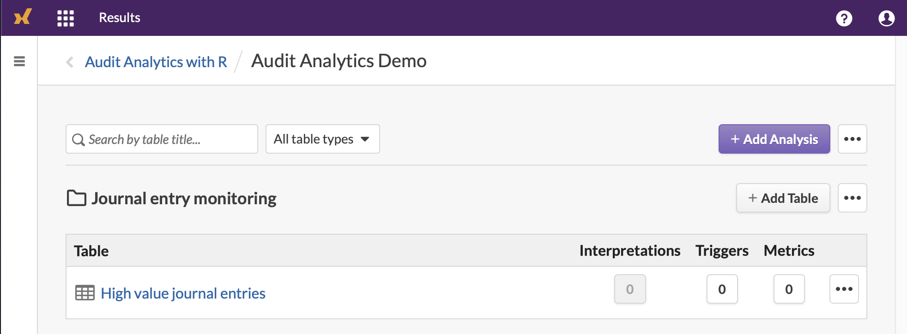
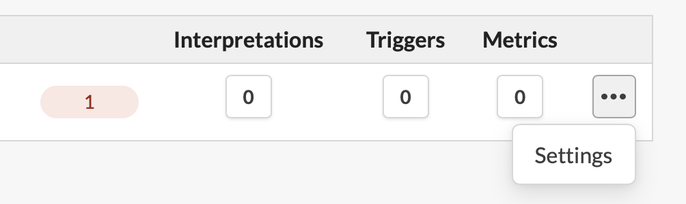
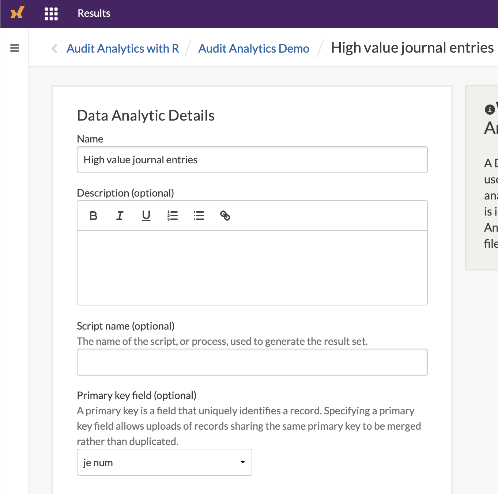

---
output:
  pdf_document: default
  html_document: default
---
# Continuous monitoring

**Continuous Monitoring** (CM) and **Continuous Auditing** (CA, or automated controls testing) relies on the same premise - that a specific entity of interest is being evaluated on a high frequency and regular basis. Both definitions are used inconsistently in the audit industry - I tend to rely on CM for general risk measurement, and CA for controls.

Continuous Monitoring is a no brainer - who would say 'no thanks' to higher coverage and more tests? Ironically, asking this same question to external auditors can really put them in a bind. Several audit firms do not have explicit guidance on the handling of reliance on internal controls being continuously tested, as current guidance is almost exclusively pointed towards sampling. See the [appendix](#appendixct) on how to help get started on establishing an agreeable methodology.

For this section we will use the company GL database, as well as your Highbond account. If you don't have one, you can still follow along and abstract where you would incorporate your technology options.

```{r, message = FALSE, warning = FALSE}
library(dplyr) 
library(tidyr) 
library(lubridate) 
library(DBI)
library(galvanizer) # See the Setup chapter to learn how to install this package

dir.create("data", showWarnings = FALSE)

download.file(url = "https://github.com/jonlinca/auditanalytics/raw/master/data/rauditanalytics.sqlite",
             destfile = "data/rauditanalytics.sqlite", mode = "wb")

con <- dbConnect(RSQLite::SQLite(), "data/rauditanalytics.sqlite")

gl <- tbl(con, 'gl') %>%
  collect() %>%
  mutate(gl_date = as_date(gl_date, origin = '1970-01-01'),
         paid_date = as_date(paid_date, origin = '1970-01-01'),
         invoice_date = as_date(invoice_date, origin = '1970-01-01')) %>%
  select(-gl_date_char)

dbDisconnect(con)
```

## Considerations

To effectively implement a CM task, you need to consider the following:

- Audit application platform - Where you choose to host the completed results and where others interact with your data needs to be secure and accessible to your stakeholders. Sophisticated platforms require audit trails for uploading of information and tracking responses.
- Close-to-event detection - An exceptions-based CM testing model will need to be ran on a frequent basis, so not only do you need direct access to the data, but a platform to execute the analysis as well.
- Timely response - Response mechanisms needs to be integrated with your business, where emerging risks and alerts need to be handled effectively to be considered reasonable.
- Comprehensiveness of evidence - Both the detection mechanism and response both need to be well documented to aid in follow-up inspection by external parties.

In the [Architecture chapter](#architecture), we explained the tooling needed to set up a modern audit department. An R workflow is optimal, it will help us automate the analysis of the data, upload new issues and download responses, and monitoring stakeholder responses and the health of the analytic. The serving of these results, however, requires a different skill set and time investment. Standing up your own interactive web platform that allows users to securely respond to your findings, while ensuring security and high availability, requires significant expertise and maintenance.

**Highbond Results** is a Governance, Risk and Compliance platform that enables the CM ecosystem. Highbond Results allows you to create the fully featured Continuous Monitoring ecosystem - once you upload data from tests completed in R, you can take advantage of the automated questionnaires and the ability to record responses securely from stakeholders. Highbond Results also provides security and access controls to the GRC web application, audit trails, and the ability to monitor controls if the responses get stale.

To get starting with implementing CM, you will need the following:

- A data analytic, ingesting data and preparing potential exceptions. You could productionize this in RStudio Connect, enabling you to run a schedule on a frequent basis.
- A control contact, someone who can inspect exceptions and provide sufficient evidence or response.
- A Highbond administrator account, which enables you access to the API.
- A product license to Results.

For an individual control, the flow of information may look something like this:

```{r out.width="100%", echo = FALSE}
DiagrammeR::mermaid("
sequenceDiagram
  data source->>data analytic: get data
  data analytic->>highbond results: API upload exceptions
  highbond results->>control executor: notify of potential issues
  control executor->>highbond results: record response & remediation
  highbond results->>data analytic: API download responses
  data analytic-->>auditor: review results
  data analytic-->>auditor: monitor health
")
```

## Create a Collection, Analytic and Table

We will create a test to detect high risk journal entries, routing them to the appropriate personnel for response. Detecting and ensuring these journal entries have extra awareness can help give comfort to external parties that journal entries are being reviewed appropriately and in a timely manner.

We will need a table upload the data into Highbond Results. You can create a table via following the help instructions on [Results app and add a new collection](https://help.highbond.com/helpdocs/highbond/en-us/Content/global_topics/get_started/quick_starts/organizing_data.htm), or you can use the galvanizer package to create the necessary items for you. 

The [galvanizer package](https://jonlinca.github.io/galvanizer/) is a package for R that 'wraps' the Highbond API. An API wrapper is one that translates the endpoints into something more useful for R, helping you understand what kind of requirements are needed to properly interact with the web application. Instead of using a mouse to interact with a website to generate the correct information, you can instead use R programming to achieve the result, gaining speed, full control and consistency.

::: {.alert .alert-danger}
**Danger!** You'll be interacting with your live Highbond environment, so be careful and ensure you do not delete or overwrite production data. If possible, use a test or training environment.
:::

Before using the API, you will need some core information to access your Highbond instance. They are:

- Highbond API token
- Organization number (or instance number)
- Data Center location

To generate a Highbond API token from your Highbond instance by referencing the [Highbond help](https://help.highbond.com/helpdocs/highbond/en-us/Content/launchpad/getting_started/managing_access_tokens.html) files. 

::: {.alert .alert-warning}
  **Treat your API token like a password!** You will require administrative privileges to interact with the API, and thus can perform any action in the system as if you were an administrator.
:::

The above information can be used to create a Highbond authentication connection:

```{r}
library(galvanizer)

highbond_openapi <- Sys.getenv('highbond_openapi') # Replace with your Highbond API token
highbond_org <- Sys.getenv('highbond_org') # Replace with your organization number
highbond_datacenter <- Sys.getenv('highbond_datacenter') # Replace with the data center

highbond_auth <- setup_highbond(highbond_openapi, highbond_org, highbond_datacenter)
```

You can see if it works by asking the API to pull your currently existing Collections (the folders at the top level of Results):

```{r}
collections <- get_results_collections(highbond_auth)

collections 
```

Its important to get a bearing on the `id` number provided - the number will correspond to the Results collections, analysis or table, depending on the endpoint you use. This is especially important as we will start creating a Collection, an Analysis and also a Table to house our results.

First, lets create our top-level folder, the Collection we want to house our analytic in:

```{r}
new_collection <- create_results_collections(highbond_auth, "Audit Analytics Demo")

new_collection
```

The `id` number is important to retain, as its needed to create the Analysis, the sub-folder within the Collection.

```{r}
new_analysis <- create_results_analyses(highbond_auth, 
                                        new_collection$id[[1]], 
                                        "Journal entry monitoring")

new_analysis
```

Lastly, we will want to make a spot to house our results, which will be stored in the Table within the Analysis. When we create the table, we will get a table ID, which will be important as it represents the number that we will reference in all our uploads.

```{r}
new_table <- create_results_tables(highbond_auth, 
                                   new_analysis$id[[1]], 
                                   "High value journal entries")

table_id <- new_table$id[[1]]

new_table
```

By now, you should see this within your Highbond Results instance.

```{r, include = FALSE}

```

## Define the High Risk test

In the Testing chapters, we ran a test to detect items [over a certain threshold](#above-threshold). We're going to use the GL database again to create our test. 

```{r te_cm}
all_hits <- gl %>%
  mutate(t_over_te = amount >= 50000) %>%
  filter(t_over_te) %>%
  select(je_num, amount, everything()) %>%
  arrange(gl_date)

all_hits
```

One key difference is that we are going to assume that, in "production" (when the analytic is live and working daily), that we will constantly be uploading records whenever they arise. To help simulate this, we're only going to upload one row into the Table to start.

```{r}
upload_rows <- all_hits %>%
  slice(1)

upload_rows
```

Lets use galvanizer and upload this record into the Highbond Results Table. Using the `post_results_records()` function, we need to specify the Highbond authentication token, the `table_id` we want to upload the information into, and the data frame itself via the `upload` argument. Since it is the inaugural upload, we also need to specify the `purge = TRUE` argument so we have a clean slate:

```{r}
post_results_records(highbond_auth, 
                     table_id = table_id, 
                     upload = upload_rows, 
                     purge = TRUE)
```

```{r, include = FALSE}
# Wait for Highbond to process results
Sys.sleep(10)
```

Upon checking the Results Table on the website, we see that the record was added.

Once we uploaded the information, we should specify the primary key in the Table's settings. The primary key's purpose in Highbond Results is to ensure that this record stays persistent. When you upload another batch of records, if a 'primary key' is defined, then Highbond will merge the information in the new upload, but not automatically repeat any triggers that have been already acted on (example: if you already sent out a request for a response via a questionnaire, it will not occur again).

In our scenario, we will want to ask the control owner about a specific journal entry that is high risk. The unique identifier for every journal entry is the `je_num`, so its probably useful to also make this the primary key. To assign this field as the primary key, within the list of Tables in Highbond, select the ellipses (three dots) corresponding to the Table, and select Settings. 

```{r, out.width = 500, echo = FALSE}

```

Within there, specify the `je_num` as the primary key.

```{r, out.width = 500, echo = FALSE}

```

## Uploading additional results

As we intend for this to be a continiously monitored control, we should make sure we can upload additional rows, simulating new results over time. First, lets get the next batch of records:

```{r}
upload_rows <- all_hits %>%
  slice(2:3)

upload_rows
```

We can use the same `post_results_records()` function to upload new records, but we'll make one change: remove the `purge` argument:

```{r}
post_results_records(highbond_auth, table_id = table_id, upload = upload_rows)
```

```{r, include = FALSE}
# Wait for Highbond to process results
Sys.sleep(10)
```

## Downloading records and responses

Once information has been uploaded, you can also retrieve the information locally for further analysis, using the `get_results_records():

```{r}
cm_control <- get_results_records(highbond_auth, table_id = table_id)
```

This data is returned in a nested list, with technical information about the data downloaded and the table columns. You may poke around to see what was returned, or just get the Table records:

```{r}
cm_control$content$data %>%
  select(je_num, amount, gl_date, vendor_id, account, invoice_date, description, paid_date, t_over_te)
```

As the Result tables are enriched with questionnaire responses from control owners, the information can be downloaded in the same manner - these questionnaires will automatically be created as new columns, prefixed with `q_`.

## Triggers and Questionnaires

Within Results, the Triggers and Questionnaires features are useful in the continuous monitoring framework. You may wish to define the following to complete your architecture:

1. A questionnaire, asking for a response from the control owner. An [effectively designed questionnaire](https://help.highbond.com/helpdocs/highbond/en-us/Content/results/questionnaires/designing_effective_questionnaires.htm) can help determine if the control owner has fully evaluated the new and developing situation.
2. An initial [trigger](https://help.highbond.com/helpdocs/highbond/en-us/Content/results/triggers/triggering_automated_responses.html) for a new record, that is sent to a control owner asking for a response.
3. A follow-up trigger for stale records, that is sent to the audit team member who is monitoring the control for responsiveness.

```{r, include=FALSE}
# Cleanup
current_results <- get_results_collections(highbond_auth)
demo_project <- current_results %>%
  dplyr::filter(name == 'Audit Analytics Demo') %>%
  dplyr::pull(id)

for (i in 1:length(demo_project)){
  delete_results_collections(highbond_auth, demo_project[i])
}
```
